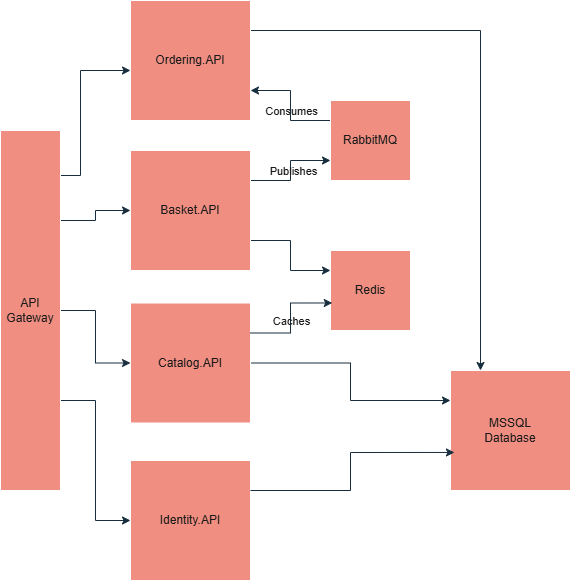

# FoodNet 🍕

A backend system for a food delivery app that handles restaurants, shopping carts, and orders — built with a microservices architecture in .NET 8.

---

## Architecture



FoodNet is composed of 5 services, all orchestrated with Docker Compose and accessible through a single API Gateway:

| Service          | Responsibility                                     | Tech                          |
| ---------------- | -------------------------------------------------- | ----------------------------- |
| **Identity API** | User registration & JWT authentication             | .NET 10, SQL Server, BCrypt   |
| **Catalog API**  | Restaurants and menu management                    | .NET 10, SQL Server, Redis    |
| **Basket API**   | Temporary shopping cart                            | .NET 10, Redis                |
| **Ordering API** | Order processing and tracking                      | .NET 10, SQL Server, RabbitMQ |
| **API Gateway**  | Single entry point, JWT validation, load balancing | YARP                          |

---

## Key Technical Highlights

### 🛒 Cache-Aside Pattern (Redis)

Restaurant menu data is cached in Redis with a 5-minute absolute expiration. On a cache miss the API falls back to SQL Server and repopulates the cache. Any write operation invalidates the relevant cache entry.

### ⚡ Asynchronous Checkout (RabbitMQ + MassTransit)

When a user checks out, the Basket API publishes a `BasketCheckoutEvent` to RabbitMQ and immediately returns a response. The Ordering API consumes the event in the background and saves the order to SQL Server. The user never waits, and if the Ordering service is temporarily down the message simply waits in the queue.

### 🔐 JWT Authentication

The Identity API issues signed JWT tokens containing the user's ID and email as claims. Every protected service validates the token independently. The user's identity travels securely across the entire system without any service needing to call back to the Identity API.

### 🛡️ Polly Retry Policies

All read operations in the Catalog API are wrapped in a Polly resilience pipeline with exponential backoff — 3 retries starting at 1 second. Brief database blips are handled gracefully without surfacing 500 errors to the user.

### ⚖️ Load Balancing (YARP)

The API Gateway uses YARP with a Round Robin load balancing policy, distributing traffic across 3 instances of each service.

---

## Tech Stack

- **Language:** C# (.NET 10)
- **Databases:** SQL Server (Identity, Catalog, Ordering), Redis (Basket, Catalog cache)
- **Messaging:** RabbitMQ + MassTransit
- **Gateway:** YARP (Yet Another Reverse Proxy)
- **Resiliency:** Polly
- **Infrastructure:** Docker, Docker Compose

---

## Getting Started

### Prerequisites

- [Docker Desktop](https://www.docker.com/products/docker-desktop/)
- [Postman](https://www.postman.com/) (for testing)

### Run the project

```bash
git clone https://github.com/AmmarElsamman/FoodNet.git
cd FoodNet
docker-compose up --build
```

To run with multiple instances (load balancing):

```bash
docker-compose up --build \
  --scale catalog-api=3 \
  --scale basket-api=3 \
  --scale identity-api=3 \
  --scale ordering-api=3
```

All services will be available through the API Gateway at `http://localhost:5000`.

---

## API Endpoints

All requests (except auth) require a `Bearer` token in the `Authorization` header.

### Identity

| Method | Endpoint         | Description           | Auth |
| ------ | ---------------- | --------------------- | ---- |
| POST   | `/auth/register` | Register a new user   | ❌   |
| POST   | `/auth/login`    | Login and receive JWT | ❌   |

### Catalog

| Method | Endpoint        | Description          | Auth |
| ------ | --------------- | -------------------- | ---- |
| GET    | `/catalog`      | Get all restaurants  | ✅   |
| GET    | `/catalog/{id}` | Get restaurant by ID | ✅   |
| POST   | `/catalog`      | Add a restaurant     | ✅   |

### Basket

| Method | Endpoint           | Description               | Auth |
| ------ | ------------------ | ------------------------- | ---- |
| GET    | `/basket`          | Get current user's basket | ✅   |
| POST   | `/basket`          | Update basket             | ✅   |
| DELETE | `/basket`          | Clear basket              | ✅   |
| POST   | `/basket/Checkout` | Checkout and place order  | ✅   |

### Ordering

| Method | Endpoint           | Description               | Auth |
| ------ | ------------------ | ------------------------- | ---- |
| GET    | `/order`           | Get all orders            | ✅   |
| GET    | `/order/{id}`      | Get order by ID           | ✅   |
| GET    | `/order/my-orders` | Get current user's orders | ✅   |
| DELETE | `/order/{id}`      | Delete an order           | ✅   |

---

## Testing

Import the Postman collection from `docs/FoodNet.postman_collection.json` to test all endpoints immediately.

**Recommended test flow:**

1. `POST /auth/register` — create a user
2. `POST /auth/login` — get your JWT token
3. Add the token as a Bearer token in Postman
4. `POST /basket` — add items to your basket
5. `POST /basket/Checkout` — place an order
6. `GET /order/my-orders` — verify your order was created

---

## Infrastructure

| Service                | Port                     |
| ---------------------- | ------------------------ |
| API Gateway            | `http://localhost:5000`  |
| RabbitMQ Management UI | `http://localhost:15672` |

RabbitMQ credentials: `admin / Password123`

---

## Future Improvements

- Role-based authorization (Admin vs Customer)
- Email verification on registration
- Refresh token support
- Payment gateway integration
- Kubernetes deployment configuration
